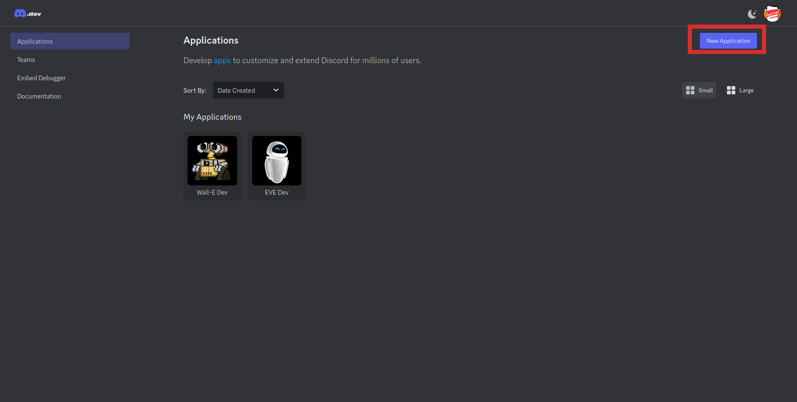
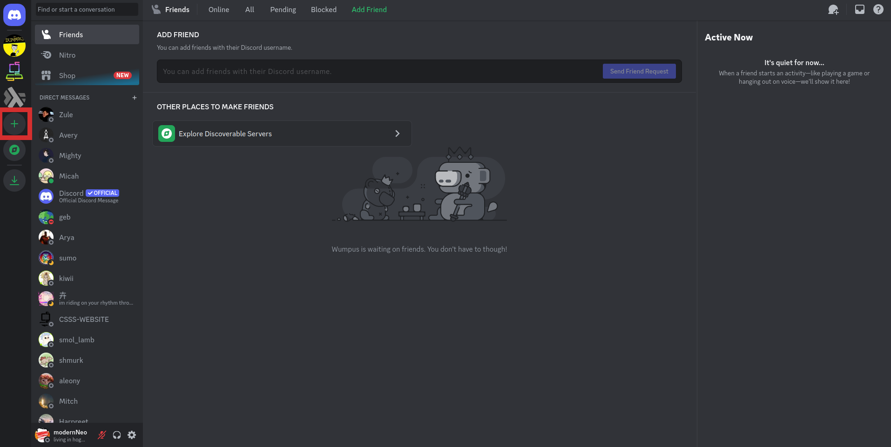
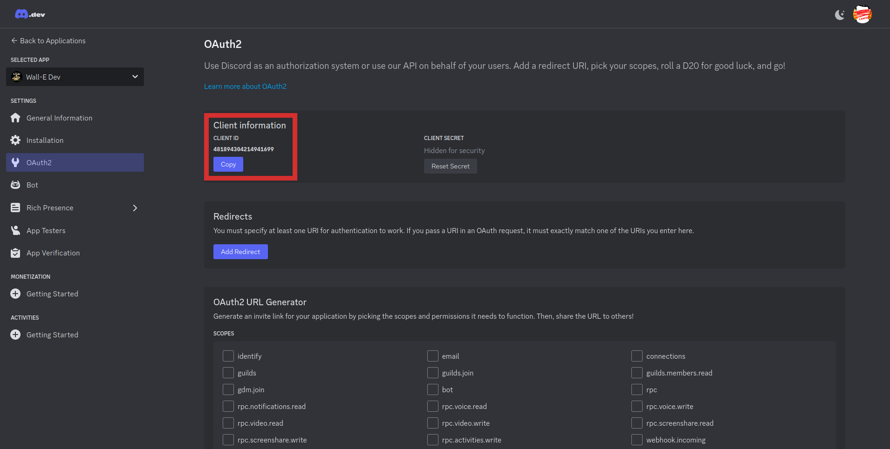
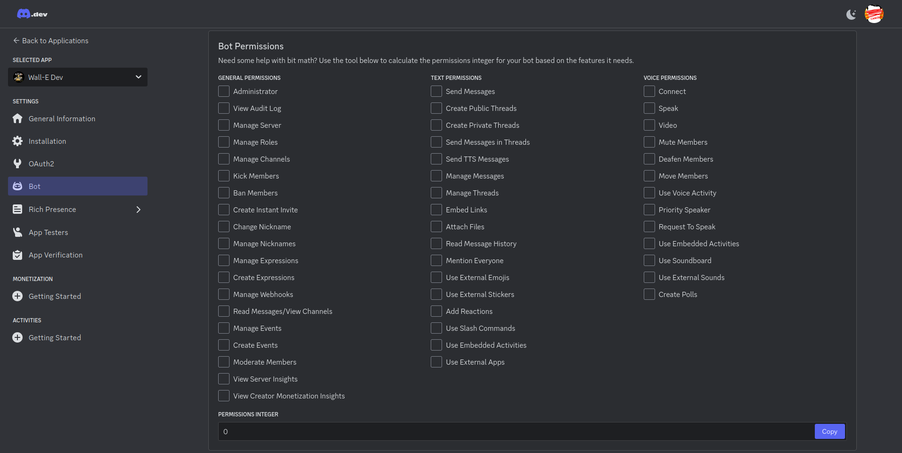
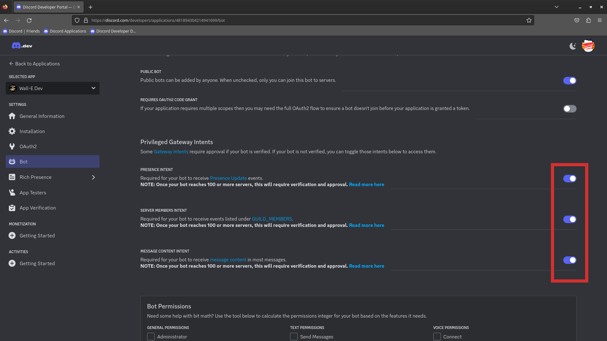

Terminology:

1. the term "Discord Bot" and "Discord Application" are interchangeable.
2. the term "Discord Server" and "Discord Guild" are interchangeable.

In both cases, the former is the more commonplace term and the later is the developer term for it.

I will generally use "bot" and "guild" in my documentation.

# Creating a new bot

When creating a new bot, you need to go to the [Discord Applications](https://discord.com/developers/applications) page, and click on `New Application` on the top right

# Creating a new Discord Guild

You will need a guild where you can interact with the bot.

You can go through the steps of creating a personal guild using the indicated button here.  
You can really select anything you want for the prompted questions after clicking that button.

# Giving a bot access to a guild

In order to actually interact with a bot, you need to invite it to the guild where you will interact with it. To do this, you need to generate an invite link and go to that link within a browser where you are logged in as the admin of the target Discord Guild.

`https://discordapp.com/oauth2/authorize?&client_id=<YOUR_CLIENT_ID_HERE>&scope=bot&permissions=<PERMISSION>`

things that need to be plugged in:
 1. YOUR_CLIENT_ID_HERE: 
 2. PERMISSION: we used to use `2119564375` which gave a bot [these permissions](https://discordlookup.com/permissions-calculator/2119564375), however, since the bot took over the role of managing the gamified point tracking, we've had to give the bot Admin access via `8` so that it's in all the channels automatically. You can create your own permission integer at this page 

# Necessary Intents

Long story short, in an effort to fight spam, discord roled out a concept called [Gateway Intents](https://discord.com/developers/docs/topics/gateway#gateway-intents) that you __can__ read but it really isn't necessary. You can just go ahead and turn on the below intents to ensure your bot has access to all information, particularly necessary for running the wall_e bot on your own guild.

